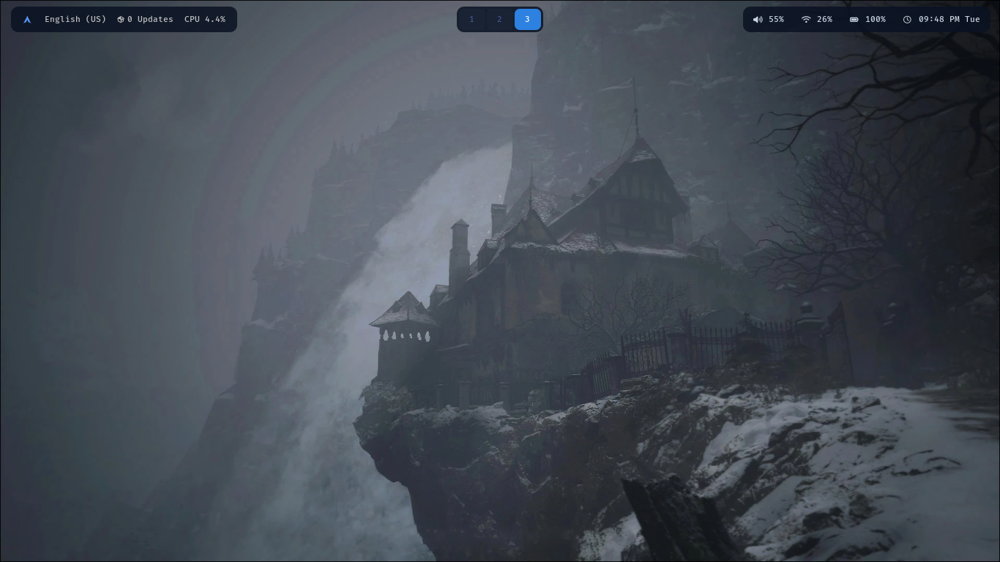

# Waybar config

My Waybar configuration files for Arch Linux + HyprLand Setup

## Screenshot



## Setup
```bash
git clone https://github.com/LUCKYS1NGHH/waybar-config
cd waybar-config
mkdir -p ~/.config/waybar
cp config.jsonc ~/.config/waybar
cp style.css ~/.config/waybar
```
